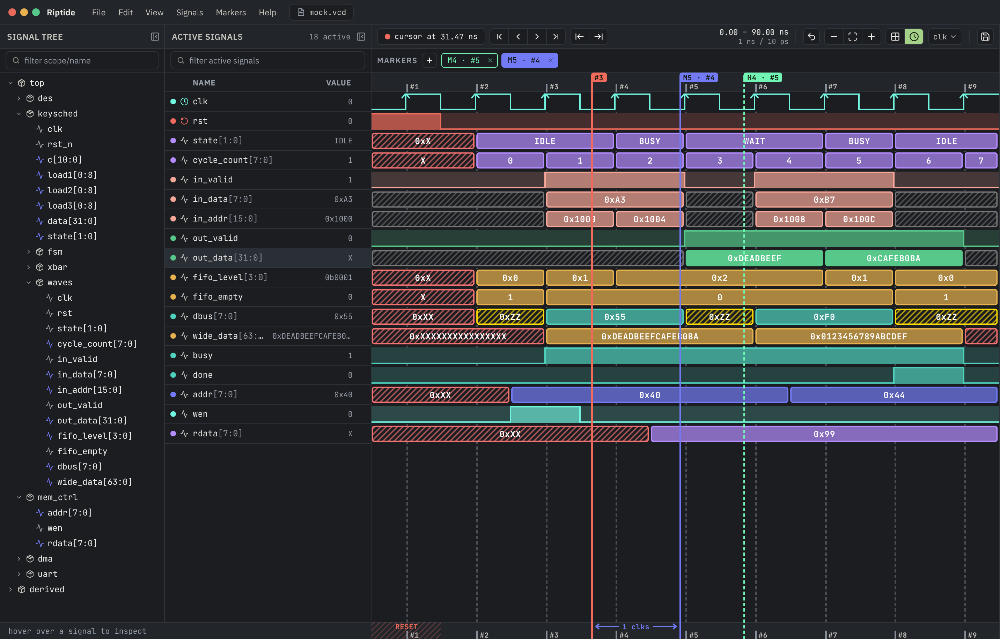

# Riptide

A waveform viewer for RTL debugging — GPU-rendered, built for traces that are too big for the tools you're used to.



Riptide opens a VCD, draws it on your graphics card, and stays smooth while you pan and zoom
through millions of transitions. Point it at your clock and the timeline counts cycles instead of
nanoseconds. Buses decode into the radix you actually want. And every bit of that setup lives in a
small JSON file next to the trace — so the view you built survives the next simulation run, and
can be handed to whoever reviews the bug.

> **Alpha.** Version 0.1.0-alpha.4 reads VCD and nothing else, and the builds are unsigned.
> It's usable for real debugging today; expect rough edges and read
> [What doesn't work yet](#what-doesnt-work-yet) before you rely on it.

---

## Install

Grab the build for your machine from the [latest release](https://github.com/coderkalyan/riptide/releases).
There's no package manager entry yet.

| Platform | File | First run |
|---|---|---|
| Linux x64 (Debian/Ubuntu) | the `.deb` | `sudo dpkg -i` it; installs to `/opt/Riptide` |
| Linux x64 (any distro) | the `.tar.gz` | Extract anywhere, run `./riptide` |
| Linux x64 (no extract) | the `.AppImage` | `chmod +x` it, then run it |
| macOS (Apple silicon) | the `-arm64.dmg` | Open, drag to Applications, then **right-click ▸ Open** |
| macOS (Intel) | the `.dmg` without `-arm64` | Same as above |
| Windows x64 | the `-setup.exe` | Run it; at the SmartScreen prompt pick **More info ▸ Run anyway** |
| Windows x64 (no install) | the `-portable.exe` | Same, but nothing is written outside the folder you run it from |

There's no arm64 build for Linux or Windows — arm64 is macOS-only.

**Which Linux file — the AppImage is the slow one.** It is a compressed filesystem image
mounted through FUSE on every launch, which costs roughly **1.9 seconds of extra startup on
every run** and never settles down the way a normal install does (measured: ~2.6 s to first
frame vs ~0.78 s for the byte-identical `.deb` and `.tar.gz`). Prefer the `.deb` if you're on
Debian/Ubuntu, or the `.tar.gz` anywhere else. Take the AppImage only if you specifically want
a single self-contained file.

**Which Windows file.** `-setup.exe` installs per-user (no admin prompt) and can update itself.
`-portable.exe` is a single file you can run from a USB stick, and cannot — see Updates below.

### Updates

Riptide checks for a new release on startup and reports it under **Help ▸ Check for Updates**,
which is also where you can check on demand. Nothing is downloaded without you asking.

| Build | Updates itself? |
|---|---|
| Linux `.AppImage`, Windows `-setup.exe` | Yes — installs when you next quit |
| Linux `.deb` | Yes — needs **Restart Now** and asks for administrator access (`dpkg` does) |
| Linux `.tar.gz`, Windows `-portable.exe`, macOS `.dmg` | No — tells you and opens the download page |

The three that can't update in place have no installer to hand the update to — and on macOS,
in-place updates additionally require a paid Apple Developer ID that Riptide doesn't have yet
(the ad-hoc signature these builds use cannot satisfy the OS's update check).

**Why the extra clicks.** These builds aren't signed by a paid developer certificate, so macOS
Gatekeeper and Windows SmartScreen both object the first time. Right-click ▸ Open (macOS) and
More info ▸ Run anyway (Windows) are the standard one-time overrides. After that they launch
normally.

**What your machine needs.** Riptide draws the waveform on your GPU and has no software fallback.
Any reasonably modern discrete or integrated graphics will do. If the GPU can't be used, the app
still opens and the rest of the UI works, but the waveform area shows *"WebGPU unavailable"* with
the specific reason — usually a driver or hardware-acceleration problem. On Linux you'll also want
working Vulkan drivers, and the Linux builds are compiled against glibc 2.31, so distributions
older than roughly Ubuntu 20.04 won't run them.

## Opening a trace

Press <kbd>Ctrl</kbd>+<kbd>O</kbd> (<kbd>Cmd</kbd>+<kbd>O</kbd> on macOS), or **File ▸ Open VCD…**.
Riptide reopens your most recent trace on launch, and **File ▸ Open Recent** keeps the last ten.

There's **no command line yet** — no `riptide` command is installed, `.vcd` files aren't associated
with the app, and dragging a file onto the window does nothing. For scripts and CI, set an
environment variable on the executable itself:

```sh
# Linux (deb install; use ./riptide or the AppImage path for the other builds)
RIPTIDE_VCD=/path/to/sim.vcd /opt/Riptide/riptide

# macOS
RIPTIDE_VCD=/path/to/sim.vcd /Applications/Riptide.app/Contents/MacOS/Riptide

# Windows (PowerShell)
$env:RIPTIDE_VCD="C:\path\to\sim.vcd"; .\Riptide-<version>-portable.exe
```

| Variable | Effect |
|---|---|
| `RIPTIDE_VCD` | Boot straight into this trace |
| `RIPTIDE_NO_TRACE` | Boot empty, ignoring the recent list (wins over `RIPTIDE_VCD`) |
| `RIPTIDE_SIDECAR` | Load and save the view from this file instead of the default |

While a trace is open Riptide watches it on disk. When your simulator rewrites the file, the reload
pill in the title bar goes warm — it deliberately does *not* reload underneath you. Press
<kbd>Ctrl</kbd>+<kbd>R</kbd> when you're ready. (macOS has no in-app title bar, so use
**File ▸ Reload File**.)

## Working with a trace

The window is three panes: the **signal tree** (your design hierarchy), **active signals** (the rows
you've chosen, with their value at the cursor), and the **waveform canvas**.

**Add signals** by double-clicking them in the tree, or select several and press <kbd>Enter</kbd>.
Right-click a scope for **Add Scope (recursive)** to pull in everything beneath it.

**Change how a value is drawn** by right-clicking its row ▸ **Format**: Binary, Boolean, Signed
Decimal, Unsigned Decimal, Hex, or Enum. Two roles live in the same menu — **Clock** and **Reset** —
which change how a 1-bit signal is drawn. Unknown (`X`) and high-impedance (`Z`) values are always
drawn as distinct hatched bands, so you can't miss them.

**Name your encodings.** Pick **Format ▸ Enum** and the gear opens a table where you type
`value → name` pairs. VCD carries no enum information at all, so this is how `2` becomes `BUSY`.
The table is saved with the view.

**Cycles, not nanoseconds.** Mark a 1-bit signal as your clock (right-click ▸ **Format ▸ Clock**)
and Riptide measures its period and phase for you. Turn on **View ▸ Align Grid to Clock** and the
timeline rules on clock edges and numbers the cycles instead of counting nanoseconds; that menu item
is greyed out until a clock exists. **View ▸ Grid Snap** makes the cursor land exactly on edges
rather than between them — it needs a clock too, though it stays clickable without one. If the
measurement comes out wrong, the row's Clock entry lets you set the edge polarity and period by
hand, and the clock picker in the toolbar has a **custom** option for period and phase together.

**Mark the interesting moments.** Press <kbd>M</kbd> to drop a marker at the cursor (up to 16), then
<kbd>[</kbd> and <kbd>]</kbd> to jump between them. Drag a marker along the canvas to move it, or
click its time in the MARKERS bar to type an exact one — a cycle number when the grid is
clock-aligned. The distance from the selected marker to the cursor is shown as you move.

**Tidy the list.** Rows can be recolored, resized, dragged into any order, and separated with
dividers (right-click ▸ **Insert Divider Above/Below**). Rows you're finished with can be dimmed
(**Dim**, or **Dim Others** to dim everything else). And any row can be *muted* by another signal —
right-click ▸ **Mute On…**, pick a 1-bit enable, and the row fades wherever that enable is low, so
gated logic stops competing for your attention.

**Find a signal by name.** Both panels have a fuzzy search box; <kbd>Ctrl</kbd>+<kbd>F</kbd> jumps to
the tree's. Type fragments in any order, separated by spaces — `rf clk` finds `TOP.hart.rf.i_clk` —
and the characters you matched are marked. Each fragment has to land inside a single path segment
unless you type the dot yourself (`hart.rf`), so a two-letter query finds *names* instead of every
path that happens to contain those two letters somewhere.

The tree stays a tree: it prunes to what matched, with the modules above each hit opened, so you can
see where a signal lives instead of reading a path off a list. Your own expand/collapse state is left
alone and never written to the sidecar — clearing the box puts the tree back exactly as it was.
<kbd>Enter</kbd> adds the first match, and double-clicking a matched module drops the filter and opens
that module in the full tree, so you can keep browsing from there.

The active-signals box *marks* instead of filtering: matching rows highlight, the rest fade, and
nothing moves — those rows line up one-to-one with the waveforms beside them. <kbd>Enter</kbd>
selects every match, so a right-click can then recolor, dim or remove the whole set at once.

### Keyboard

| Keys | Action |
|---|---|
| <kbd>Ctrl</kbd>+<kbd>O</kbd> | Open a VCD |
| <kbd>Ctrl</kbd>+<kbd>R</kbd> | Reload the open trace from disk |
| <kbd>Ctrl</kbd>+<kbd>F</kbd> | Focus the signal-tree search box |
| <kbd>Ctrl</kbd>+<kbd>=</kbd> / <kbd>Ctrl</kbd>+<kbd>-</kbd> | Zoom in / out |
| <kbd>Ctrl</kbd>+<kbd>0</kbd> | Zoom to fit |
| <kbd>Ctrl</kbd>+<kbd>W</kbd> | Close the window |
| <kbd>M</kbd> | Add a marker at the cursor |
| <kbd>[</kbd> / <kbd>]</kbd> | Previous / next marker |
| <kbd>Backspace</kbd> or <kbd>Delete</kbd> | Delete the selected marker |
| <kbd>Enter</kbd> | Add the tree selection to the view |
| <kbd>Esc</kbd> | Clear the tree selection |

On macOS these are <kbd>Cmd</kbd> chords. <kbd>Enter</kbd> and <kbd>Esc</kbd> act on the signal tree
and need it focused — click a row in it first. **Help ▸ Keyboard Shortcuts** lists the same table
in-app, built from the menu itself so it cannot drift.

### Mouse

| Gesture | Action |
|---|---|
| Click or drag on the canvas | Place and scrub the cursor |
| Scroll | Pan through time (does nothing while the whole trace fits on screen) |
| <kbd>Ctrl</kbd>+scroll | Zoom around the pointer |
| Drag a marker | Move it |
| Drag a row in the active list | Reorder it |
| Drag a row's bottom edge | Change its height |
| Drag a pane edge | Resize the pane (double-click to reset) |

## The sidecar: your view, saved next to the trace

Everything you set up — which signals, in what order, their colors, radixes, enum tables, heights,
dividers, muting, the clock you picked, your markers, and where the cursor sits — is written to a
small JSON file beside the trace:

```
sim.vcd
sim.vcd.sidecar.json
```

It saves itself as you work, so there's no project to create and nothing to remember. Delete the
file to start from a blank view.

The useful part: **signals are keyed by hierarchical path, not by index**, so the same sidecar opens
correctly against a *different run* of the same design. Re-run the simulation, reopen the trace, and
your window comes back exactly as you left it. Anything the file references that no longer exists is
quietly skipped rather than failing the load.

That makes it a way to hand off a bug. Attach the VCD and its sidecar to the ticket and the reviewer
lands on the failing cycle with the right signals already on screen. A CI job can write one directly
— the format is documented in [docs/sidecar.md](docs/sidecar.md) with a JSON schema in
[docs/sidecar.schema.json](docs/sidecar.schema.json).

**File ▸ Export Sidecar…** writes a copy with this window's own UI state stripped out — pane sizes,
which scopes are expanded, the grid toggles, and the selected timebase — so the recipient keeps
their own layout. Signals, colors, radixes, enum tables, row heights, dividers, muting, markers and
the cursor all travel. Note the default export name is `sim.sidecar.json`, *not* the
`sim.vcd.sidecar.json` that gets loaded automatically, so use **File ▸ Import Sidecar…** to apply
one you've been given.

## What doesn't work yet

Being blunt, so you can judge whether it fits your flow:

- **VCD only.** No FST, WLF, or GHW. Large traces are handled well, but they have to be VCD.
- **No live simulator control.** Riptide reads dumps; it doesn't run or step your simulator.
  Verilator, Icarus and Vivado xsim are what the parser is tested against, not integrations.
- **No derived signals.** You can't yet build a row from an expression like `valid & ready`.
- **No value search.** Signal *names* are searchable — fuzzy, in both panels (**Ctrl+F**) — but
  there is no "find this pattern in the waveform", and no assertion or glitch flagging.
- **No signal groups.** You can order, color and divide rows, but not collapse a handshake into one
  bundle. Undo/redo, cut/copy/paste, New Window and Reset Layout are also unimplemented menu entries.
- **No command line, no file associations, no drag-and-drop.**

## Building from source

You need **Node 22**, **pnpm 9**, and a **Rust toolchain** (edition 2024, so 1.85 or newer). The
waveform database and VCD parser are the **tide** git submodule, and the build fails without it.

```sh
git clone --recurse-submodules https://github.com/coderkalyan/riptide.git
cd riptide
pnpm install
pnpm dev
```

| Command | What it does |
|---|---|
| `pnpm dev` | Debug build of the native addon and app, then launches it (`pnpm dev --blank` starts with no trace) |
| `pnpm build` | Release build into `dist/` |
| `pnpm check` | Typechecks both TypeScript projects and validates the WGSL shaders |
| `pnpm test` | Runs the test suites; each self-skips if its tooling is absent |
| `pnpm release` | Release build plus a packaged installer for your platform in `dist/installers/` |

Shader validation needs `naga-cli` (`cargo install naga-cli --locked`) and is skipped with a warning
if it's missing. The test corpus isn't vendored — see [TESTING.md](TESTING.md), which also records
which suites are currently red. Architecture notes live in [CLAUDE.md](CLAUDE.md).

## Contributing

Issues and pull requests are welcome. If you're reporting a rendering or performance problem, the
trace matters — a VCD that reproduces it (or a script that generates one) is worth far more than a
description.

## License

[AGPL-3.0-or-later](LICENSE). You may use, modify and redistribute Riptide freely; if you distribute
a modified version, or run one as a network service, those changes have to be available under the
same terms.

The published `v0.1.0-alpha.1` and `v0.1.0-alpha.2` releases predate the relicense and remain
available under Apache-2.0.

Copyright © 2026 Kalyan Sriram
