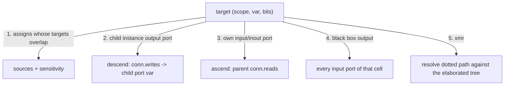

# Riptide source debug info (SDI)

An **SDI file** is JSON that tells Riptide what the trace cannot: the real type of
every signal, where every signal is declared, every place in the source that
writes or reads it, and how signals feed each other — enough to compute a static
cone of influence without a netlist.

It is **not** waveform data and **not** viewer state. Three files, three owners:

| File | Owns | Written by |
|---|---|---|
| `sim.vcd` / `.fst` | hierarchy + samples | the simulator |
| `sim.vcd.sdi.json` | design facts: types, enums, source spans, connectivity | an elaborating front end |
| `sim.vcd.sidecar.json` | viewer state: rows, colors, cursor, window | Riptide (and CI scripts) |

- **Default path:** `<trace>.sdi.json` next to the trace — `sim.vcd` pairs with
  `sim.vcd.sdi.json` (the extension is appended, not replaced). For anything
  industrial-scale, ship `<trace>.sdi.json.gz` instead: gzip is a measured 4× on
  this content, which puts SDI at roughly the size of the source it describes.
- **Override:** `RIPTIDE_SDI=/path/to/file.json`.
- **Delete it** and Riptide falls back to whatever the trace carries — the tree
  still opens, just VCD-grade.
- **Schema:** [`docs/sdi.schema.json`](./sdi.schema.json) (JSON Schema 2020-12).
- **Worked example:** [`samples/sdi/`](../samples/sdi/) — `gate.sv` (98 lines of
  SystemVerilog), `gate.vcd` (a real Icarus run of it), and `gate.vcd.sdi.json`
  covering it completely.
- **Reference consumer:** [`tools/sdi-cone.mjs`](../tools/sdi-cone.mjs) — elaborates
  the tree, binds it to the VCD, and answers the driver/reader/cone queries. Run
  it to see what the format buys before writing a producer.

Riptide does not produce SDI. Populating it is a front end's job (Verilator,
slang, Yosys, a simulator, your generator) — see [Producing SDI](#producing-sdi).

**Status.** The tree half is implemented: `native/src/design.rs` loads an SDI beside
the trace and `getHierarchy` emits declared types, directions, ranges, declaration
sites, doc comments, enum tables and scope kinds, which the renderer shows in both
panels' tooltips and in **Open Declaration** (via `launch-editor`, no built-in code
viewer). The dataflow half — `processes`, `conns`, driver lists, cone of influence —
is specified and exercised by `tools/sdi-cone.mjs` but not yet consumed by the app.

## Why not an existing format

Nothing on the shelf carries all three of *typed tree*, *per-signal source spans
including drivers*, and *connectivity*. What was surveyed, and what it gives:

| Format | Typed tree + enums | Source spans | Connectivity |
|---|---|---|---|
| VCD | one of ~12 keywords + a width; `logic`/`bit`/`int` indistinguishable; unpacked arrays absent entirely | none | none |
| FST | 30 var types (`logic` vs `bit` vs `int` survive), enum tables, pack/array scope attrs | `(file, line)` per scope, definition + instantiation, **no column, no range** — and no SystemVerilog producer writes it | none |
| GTKWave `.stems` | none — not even wire vs reg | `++ module <m> file <f> lines N - N` per module; the one signal-level record (`++ var`) has no file, no line, no type, and has never had a consumer | `++ comp` gives instance→module only; no ports, so no net graph |
| Verilator `--json-only` | full dtype graph, enums, struct members — but **no widths and no member bit offsets** | `loc: "e,28:16,28:21"` + a file table: the best compact encoding here | full AST; derivable, not given |
| Yosys `write_json` | enums + `wiretype`; structs and arrays are gone | `src: "f.sv:28.16-28.21"` on modules/cells/nets, decl + instantiation via `$scopeinfo` | **bit-level, the only real answer** — but post-synthesis names |
| slang `--ast-json` | complete: enums with base types, struct `bitOffset`, packed/unpacked dims | symbol and expression ranges | resolvable via `symbol` links |
| UHDM | complete IEEE 1800 object model | `(file, line, col, endLine, endCol)` on every object | expression trees |
| IP-XACT / SystemRDL | register fields only | none | none |

So: **borrow, don't adopt.** SDI takes FST's interned path table, Verilator's
compact `loc` encoding, Yosys's `file:line.col-line.col` granularity and bit-level
edges, slang's struct offsets and enum base types, wellen's var/scope vocabulary,
and CIRCT's `dbg` idea that one source variable may map to several trace signals
and that a scope may have been flattened away. The two candidates that carry
everything semantically are unusable as a contract: slang's AST dump is
unversioned and keyed by raw pointer values, and UHDM ships only a Cap'n Proto
schema generated at build time, with no Rust or JS reader.

`.stems` is the direct ancestor and the clearest lesson. It has 15 expressive gaps
(no types, no enums, no declarations, no drivers, no connectivity, no bit
granularity, one flat module namespace, whitespace-delimited fields with no
escaping, `lines N - N` so its consumer re-lexes the file to find the real span,
and — the root cause of every other failure — it never names a single trace
signal, so wave↔source association is re-derived at runtime by string matching a
textual identifier scrape). Its producer path is also dead: the documented
`verilator --xml-only | xml2stems` flow stopped working when Verilator 5.046
removed `--xml-only`.

## Shape

```jsonc
{
  "version": 1,
  "generator": { "tool": "verilator", "toolVersion": "5.050", "sourceRoot": "." },
  "fidelity":  { "tree": "complete", "types": "declared",     // only positive claims;
                 "drivers": "complete", "bits": "exact", "coi": "partial" },  // absent = unclaimed
  "trace":     { "format": "vcd", "rootPrefix": "tb", "rangeInName": true },

  "files": [ { "path": "gate.sv", "blake3": "3ec55800…" } ],       // interned; index = fileId
  "types": [ /* interned type table; index = typeId */ ],
  "units": [ /* scope DEFINITIONS: modules, generate blocks, functions … */ ],
  "design": { "roots": [ { "name": "dut", "unit": 4 } ] },          // where elaboration starts
  "warnings": [ "cone is partial: gate.u_crc is a black box" ]
}
```

Every reference is an integer index into one of those arrays. Two conventions
recur and are worth internalising:

- **`span` = `[file, line, col?, endLine?, endCol?]`** — 1-based, `endCol`
  exclusive, `endLine` defaults to `line`. `[0, 91, 3, 91, 31]` is
  `gate.sv:91:3-91:31`; `[0, 91]` is "line 91, whole line".
- **`bits` = `[lsb, width]`** — a slice of a variable in the **flattened bit
  order the trace stores**, not per-dimension indices. `[4, 8]` is bits 11:4.
  A whole-variable reference omits `bits` rather than writing `[0, width]`.
  Zero width is legal: a void- or unit-typed signal carries no bits and still
  participates in dataflow, so it constrains nothing rather than matching nothing.

Spans are line/column, not character offsets, and that is deliberate. Offsets
measure 1.5% smaller on the sample — no real saving, because line and column are
small integers while offsets are large ones. Against that: no surveyed producer
emits offsets (Verilator, slang, Yosys and UHDM all report line/column), a CRLF
checkout of the same logical file invalidates every offset while line/column
survives it, and printing `gate.sv:91:3` in a driver list would require reading
the source file first.

Both are positional arrays because they are the two most numerous objects in the
file; `{"file":0,"line":91,…}` costs 4× the bytes for the same content.

### Definitions, not an elaborated dump

`units` stores each scope's contents **once per definition**. The tree the user
sees is the walk of `design.roots` through each unit's `instances`. A design with
2 000 instances of a 50-signal FIFO stores 50 variables, not 100 000 — file size
tracks design source, and the dataflow inside the FIFO is stored once and reused
by every instance.

Units are **specialized**: a module instantiated with two parameter sets is two
units, and each generate iteration is its own unit. That keeps one invariant that
matters — every `params[].value`, every `type.width`, every `bits` range in a unit
is concrete. No consumer ever evaluates a parameter expression. (`.stems` chose
the opposite and collapsed parameterized variants into one record.)

A unit not reachable from `design.roots` is a declaration-only scope: a package, an
unused module. Legal, and useful for "go to the definition of this type".

## The typed tree

`types` is an interned table, discriminated by `kind`: `bits`, `enum`, `struct`,
`union`, `packedArray`, `unpackedArray`, `alias`, `real`, `string`, `event`,
`void`, `chandle`, `class`, `interface`, `opaque`.

Three fields do the un-binning that VCD makes impossible:

| Field | Why |
|---|---|
| `keyword` | The declared spelling — `logic`, `bit`, `reg`, `wire`, `int`, `std_ulogic_vector`. VCD bins all of these into `reg`/`wire`; FST keeps 30 of them; this keeps whatever the source said. |
| `states` | 2, 4 or 9. `bit`/`int` are 2-state, `logic`/`reg` 4-state, VHDL `std_logic` 9-state. Riptide's `stateCount()` already switches on this and has never had a real input. |
| `width` | **Required** on every bit-representable type: the flattened bit count as the trace stores the variable. No surveyed producer emits it and every consumer needs it, so recomputing it means reimplementing a front end's width rules. Precompute it once, in the producer. |

Aggregates carry what a viewer needs to slice a member out of the parent's samples:

```jsonc
{ "kind": "struct", "name": "pkt_t", "packed": true, "width": 12, "states": 4,
  "decl": [0, 20, 5, 20, 10],
  "members": [
    { "name": "payload", "type": 3, "lsb": 4, "decl": [0, 17, 17, 17, 24] },
    { "name": "len",     "type": 4, "lsb": 1, "decl": [0, 18, 17, 18, 20] },
    { "name": "last",    "type": 0, "lsb": 0, "decl": [0, 19, 17, 19, 21] }
  ] }
```

`lsb` is required for packed aggregates. Verilator and Yosys give member names but
no offsets; slang gives `bitOffset`; a consumer that guesses by summing widths in
declaration order breaks the day a front end changes its padding.

Enums carry the base type, so width, signedness and state count are exact — FST's
enum table is a flat literal↔bitstring map that loses both:

```jsonc
{ "kind": "enum", "name": "state_e", "width": 2, "states": 4, "base": 1,
  "values": [ { "name": "IDLE", "value": "0x0", "decl": [0, 10, 5, 10, 16] },
              { "name": "BUSY", "value": "0x1", "decl": [0, 11, 5, 11, 16] },
              { "name": "DONE", "value": "0x3", "decl": [0, 12, 5, 12, 16] } ] }
```

Values are strings interpreted against the type they belong to: `0x…`/`0b…` (with
`x`/`z` allowed) or a decimal integer for bit types, a JSON number for reals, the
JSON string itself for string types. Never a JSON number for a wide bit value —
a 64-bit enum key does not survive a double.

A variable adds the axes the type does not own:

```jsonc
{ "name": "rst_n", "type": 0, "kind": "var", "direction": "input",
  "decl": [0, 29, 24, 29, 29], "comment": "active-low reset",
  "hints": { "role": "reset", "polarity": "activeLow" } }
```

- `kind` is how it is driven (`net`, `var`, `param`, `genvar`, `memory`, `alias`) —
  orthogonal to the value type, the same split tide-core draws.
- `direction` is port direction. VCD carries none; Riptide's `Direction` enum has
  existed for a while with only `implicit` ever reaching it.
- `netType` (`tri`, `wand`, `supply0`, …) survives separately, because resolution
  semantics explain multi-driver behaviour.
- `hints` are producer suggestions — `role: "clock"` lets Riptide configure a clock
  without measuring waveform periods, and `radix`/`group`/`hide` seed a default
  view. The sidecar always wins: it is the user's decision, hints are the tool's.
- `attrs` is the verbatim `(* … *)` bag.
- `traceOmitted` marks a variable the producer knows is not in the trace, so a
  viewer greys it out instead of reporting a failed lookup.

## Binding to the trace

The single lesson from `.stems`: never rely on name-string luck. SDI states the
mapping and provides an escape hatch at every level.

A variable's trace path is `[rootPrefix] + instance path + leaf`, joined by
`trace.separator`. The **leaf** is resolved in this order:

1. `var.traceName`, if the producer knows the exact string the dumper wrote.
2. `var.name`.
3. With `trace.rangeInName`, `name[msb:lsb]` and `name [msb:lsb]`, from the type's
   declared range (or `[width-1:0]`).

All three spellings occur in practice. Icarus writes `$var wire 12 , hdr [11:0]`
(space-separated, so the range is a separate token that tide drops → leaf `hdr`);
Riptide's own bundled mock writes `$var wire 11 # c[10:0]` (glued, so the range is
part of the name). A miss is a warning and a skip, never a failure — same
tolerance rule as the sidecar.

Four structural mismatches get explicit fields rather than heuristics:

| Situation | Field |
|---|---|
| Dumper adds a root scope with no design counterpart (Verilator's `TOP`, or a testbench that was not analyzed) | `trace.rootPrefix` |
| One source variable became several trace signals — a packed struct exploded into per-member signals, an unpacked array into per-element signals, a bit-blasted vector | `var.traceSignals: [{ path, bits }]` |
| A scope was inlined away, so its contents appear in the parent with mangled names | `instance.inlined` + `instance.tracePrefix` |
| An instance array `u[0]`, `u[1]`, … | `instance.array: [left, right]` |

`traceSignals` is the CIRCT `dbg.variable` idea: the design view and the dumped
view are different trees, and only the producer knows how they were related.

**Verified against a real trace.** `tools/sdi-cone.mjs check samples/sdi/gate.vcd`
elaborates the sample, applies exactly these rules, and reports what bound:

```
  refs resolved: 79/79
  trace binding: 27 matched, 3 declared-omitted, 0 unexplained  (39 signals in gate.vcd)
```

The 3 declared-omitted are `st`, `lane_out` and `mem` — unpacked arrays, which
`$dumpvars` does not dump at all. Nothing bound by accident and nothing was left
unexplained.

## Where a signal goes

Declaration is the easy half, and the only half `.stems` and FST attempt. The
useful half is **every site that writes or reads the signal**, which SDI derives
from one structure: a unit's `processes`.

A `process` is one RTL construct — `contAssign`, `alwaysComb`, `alwaysFF`,
`alwaysLatch`, `initial`, `assertion`, `vhdlProcess`, … It owns the sensitivity
list; the individual writes are its `assigns`, each with its own location, because
the *statement* line is what a user wants when asking "where is this assigned".

```jsonc
{ "kind": "alwaysFF", "loc": [0, 87, 3, 87, 33],
  "sense": [ { "edge": "pos", "ref": { "var": 0 }, "role": "clock" } ],
  "assigns": [
    { "loc": [0, 88, 24, 88, 48], "text": "if (st[0] == DONE) mem[wptr] <= lane_out[0];",
      "nonBlocking": true, "guarded": true,
      "targets": [ { "var": 10, "dynamic": true, "select": "mem[wptr]" } ],
      "sources": [ { "var": 8, "bits": [0, 8], "select": "lane_out[0]" },
                   { "var": 4, "role": "index" },
                   { "var": 7, "bits": [0, 2], "role": "control", "select": "st[0]" } ] } ] }
```

Everything a debugger asks falls out of this one record:

- **Writers of X** — assigns whose `targets` hit X. Each yields a location, the
  source text, whether it is sequential, and whether it is `guarded` (conditional,
  so X holds its old value when the condition is false — a latch or an enable).
- **Readers of X** — assigns whose `sources` hit X, plus `sense` entries, plus
  `process.reads` for constructs that read without assigning (an assertion, a
  `$display`). A read-only construct needs no fake target.
- **Why X changed** — the `role` on each source separates `data` from `control`
  (an enclosing `if`/`case` condition), `clock`, `reset`, `enable` and `index`.
- **How exact this is** — `dynamic: true` marks a non-static select, so a consumer
  widens conservatively and labels the answer approximate rather than lying.

`assign.text` and `conn.text` are optional and worth emitting: they let a viewer
list drivers with their code when the source files are stale or absent on the
reviewer's machine. SDI never inlines whole source files — a design's sources are
the design's to ship, and `files[].blake3` is what tells you whether the copy you
have still matches the spans.

Boundaries are crossed by `instance.conns`, which record the parent-side variables
each port reads and writes, so no consumer ever parses a connection expression:

```jsonc
{ "port": 5, "name": "dout", "loc": [0, 81, 7, 81, 27], "text": ".dout (lane_out[i])",
  "writes": [ { "up": 1, "var": 8, "bits": [8, 8], "select": "lane_out[1]" } ] }
```

Note `up: 1`. Refs resolve in the enclosing unit by default; `up` walks out
through block-like scopes (generate/named blocks, functions, struct and array
scopes) to the module around them. A generate block driving a module-level net is
the common case in real RTL, not an edge case. Module boundaries are opaque to
`up` — crossing those is what `conns` is for. Anything else, including a genuine
cross-module reference, is an `xmr` ref carrying a dotted path.

## Cone of influence

A signal node is `(instance path, variable, bit slice)`. The graph is not stored;
it is walked, from `processes` and `conns`, in five moves:



Backward from a target, taking sources; forward from a source, taking targets.
Each edge is classified from the construct that produced it:

- **comb** — combinational: a continuous assign, an `alwaysComb`, a port
  connection.
- **seq** — sequential: `alwaysFF`/`alwaysLatch`, any process with an edge in its
  sensitivity list, or an assign with a delay.

That single bit gives the two cones a debugger actually wants. Stopping at
sequential edges answers *"what set this value in this cycle"* — usually a handful
of signals. Crossing them (`--cross-seq`) answers *"what can influence this at
all"*, reaching primary inputs. Filtering to `role: "data"` drops control
dependence and shrinks the cone again.

Termination and honesty:

- Memoize on the node key; the walk is a BFS over a finite elaborated graph.
  Self-edges (`acc <= acc + din`) are normal and terminate.
- A black box (`blackBox: true`, no `unit`) contributes every input to every
  output, marked `approx`. Conservative, never silently empty.
- An unresolvable `xmr` becomes an explicit unresolved edge, not a missing one.
- `fidelity.coi` states whether the graph is closed at all. A viewer should label
  a cone from a `partial` file as possibly incomplete — the whole reason
  `fidelity` exists.

**Why the cone is walked and not stored.** Three reasons, all of them structural.
A cone is not a tree — the sample already has reconvergent fanout at 98 lines
(`lane_out[7:0]` reaches `sum` directly *and* through `crc`) and a self-loop
(`acc <= acc + din`), so any tree-shaped encoding either duplicates shared
subgraphs or truncates. It is quadratic — on the sample, 39 stored edge slots
expand to 237 summed cone nodes across 30 elaborated variables, and cone size
grows with logic depth × fan-in. And it is **per-instance while the file is
per-definition**: `g_lane[0].u_lane.acc` and `g_lane[1].u_lane.acc` have different
cones, so storing cones means storing an elaborated graph — reintroducing exactly
the instance-count blowup that keeps this format proportional to design source.
Edges stay per-definition and are instantiated against a path at query time.

There is also no single cone to store: same-cycle vs cross-sequential, data-only
vs with control, backward vs forward, and per-bit-slice are all different and all
useful answers. The format stores the generators; the consumer takes the closure it
asked for.

The reference implementation is 126 lines (`buildSites` + `cone` in
`tools/sdi-cone.mjs`). On the sample:

```
$ node tools/sdi-cone.mjs samples/sdi/gate.vcd.sdi.json cone dut.sum
cone of influence of tb.dut.sum  — data + control, same cycle (stops at flops)
  level 1
    tb.dut.sum ← tb.dut.lane_out[7:0]  (comb) gate.sv:95:3
    tb.dut.sum ← tb.dut.lane_out[15:8]  (comb) gate.sv:95:3
    tb.dut.sum ← tb.dut.crc  (comb) gate.sv:95:3
  level 2
    tb.dut.lane_out[7:0] ← tb.dut.g_lane[0].u_lane.dout  (comb) gate.sv:81:7
    tb.dut.lane_out[15:8] ← tb.dut.g_lane[1].u_lane.dout  (comb) gate.sv:81:7
    tb.dut.crc ← tb.dut.lane_out[7:0]  (comb blackBox approx) gate.sv:85:35
  level 3
    tb.dut.g_lane[0].u_lane.dout ← tb.dut.g_lane[0].u_lane.acc  (comb) gate.sv:54:3
    tb.dut.g_lane[1].u_lane.dout ← tb.dut.g_lane[1].u_lane.acc  (comb) gate.sv:54:3
  level 4
    tb.dut.g_lane[0].u_lane.acc ← tb.dut.g_lane[0].u_lane.acc  (seq) gate.sv:51:24
    tb.dut.g_lane[0].u_lane.acc ← tb.dut.g_lane[0].u_lane.din  (seq) gate.sv:51:24
    tb.dut.g_lane[0].u_lane.acc ← tb.dut.g_lane[0].u_lane.state  (seq control) gate.sv:51:24
    tb.dut.g_lane[0].u_lane.acc ← tb.dut.g_lane[0].u_lane.clk  (seq clock) gate.sv:51:24
    …
  8 node(s), 16 edge(s)
```

Three module boundaries, two generate blocks, a bit-sliced concatenation and a
black box, every edge carrying the line that produced it.

## Fidelity levels

Every `fidelity` axis is a **positive claim, and every one is elidable**: an absent
axis means the producer said nothing and a consumer must assume the weakest
reading. So a file only ever states what it has earned, and the three useful
levels are the three sets of claims worth making:

| Level | `fidelity` | Cost | Buys |
|---|---|---|---|
| Tree | `{ tree, types }` | cheap — one walk of an elaborated hierarchy | typed tree, enums, struct offsets, declaration spans, go-to-declaration |
| Sources | `+ drivers` | needs statement-level traversal | driver and reader lists, whole-signal cone |
| Exact | `+ bits, coi` | needs lvalue/part-select resolution | per-bit cones, struct-member drivers, honest `dynamic` marks |

What elision cannot express is why the section exists at all. A unit with no
`processes` is either a purely structural wrapper — a fact worth showing — or a
unit nobody analyzed, and only the producer can tell those apart. Without the
claim, every empty driver list is ambiguous, and a viewer must either cry wolf
("this signal has no driver!") or stay silent when it should not.

`units[].fidelity` overrides the file-level claim for one unit, which is how a
design with some encrypted IP or unparsed files stays honest.

## Scale, and the startup budget

Two worries are worth taking seriously about a format like this: that it is bigger
than the source it describes, and that loading it spoils a near-instant open. Both
were measured; the first turns out to be an artifact of measuring uncompressed, and
the second is a placement question, not a size question.

**Size, against the source itself.** From the worked example (`gate.sv` is 2 419 B
for 98 lines, so 25 B/line):

| SDI variant | raw | B/line | gzipped | B/line | vs source |
|---|---|---|---|---|---|
| full | 10.7 KB | 109 | 2.7 KB | 27 | **1.1×** |
| lean — no `text`/`select`/`spelling`/`comment` | 8.8 KB | 90 | 2.2 KB | 22 | **0.9×** |
| tree only — no `processes`/`conns` | 5.9 KB | 60 | 1.7 KB | 18 | 0.7× |
| tree only, lean | 5.2 KB | 53 | 1.5 KB | 15 | 0.6× |

So gzipped SDI ships in about the bytes of the source it describes, and a lean
profile ships in fewer. The 4.4× raw figure is the one to ignore: nothing needs to
move uncompressed, and the two levers are both free — **gzip is 4×, dropping the
four display-string fields is another 18%**. Instance count never enters into any of
it, which is what storing definitions rather than an elaborated dump buys.
Pretty-printing, by contrast, costs 3.3× the bytes and buys nothing at runtime, so
emit minified for real designs and pretty-print only samples meant to be read.

**Load, and why it is not on the startup path.** Nothing in SDI is needed for first
paint. The tree, the samples and the timeline all come from the trace; SDI only
*enriches* what is already on screen. And because an SDI file is optional by
definition — delete it and the trace still opens, just VCD-grade — graceful
degradation is mandatory anyway, which makes deferring the load free rather than a
compromise.

Concretely, against how startup works today: `loadVcd` is synchronous and
`buildScene` runs at module load (`scene:start` → `scene:hierarchy` → `scene:end`).
**SDI must not join that sequence.** It loads after the first frame, off the JS
thread on the napi async path `searchTree` already uses, and the tree re-renders
enriched when it lands. Measured with `serde_json` into typed structs on a synthetic
SoC-scale file (55 000 units, 242 000 variables, 385 000 refs ≈ 1 M lines of RTL):

| Stage | file | read + parse | reverse index | peak RSS | when |
|---|---|---|---|---|---|
| tree fields | 55.6 MB | 32 ms + 352 ms | — | 273 MB | after first paint, in background |
| `processes` + `conns` | +35 MB | +309 ms | 91 ms | 544 MB | first driver or cone query |

On a million-line design the tree is therefore enriched roughly a third of a second
after the waveform is already interactive, and the dataflow half is not read until
someone asks a question that needs it. Startup itself is unchanged.

`544 MB` is a naive `serde` derive — a `Vec` per nested list, a `Box<str>` per name.
Interning strings saves a measured 65 MB (2.1 M string values, 66 K distinct), and
the dense-arena pattern this repo already uses — `native/src/hierarchy.rs`'s flat
`Vec<Node>`, tide-core's interned `Ref` plus index ranges — removes most of the
rest. `[INFERENCE]`

**If a real design still breaks this,** the escape hatch is sharding: one SDI file
per IP block, loaded as the user descends into it, which also matches how industrial
flows generate design info — per block, by different tools, at different times. It is
not in v1 because every reference here is an integer index *within one file*, so
composition needs name-keyed cross-file references and a merge rule, and that is
machinery worth adding when someone has the workflow rather than in advance.

**Caching is deferred**, and the measurements are why: the addon holds the parsed
graph for the session, so the reverse index is built once and every query after that
is an in-memory hash lookup. An on-disk cache only buys cold-start-free queries
*across app launches*. When that is wanted it is a private implementation detail —
**deliberately outside this spec**, versioned by the consumer, rebuildable from the
JSON. For reference: a SQLite build took 1.4 s once and answered a single-signal
driver query in **0.4 ms** from a cold process without loading the design.

Why the wire format stays text, given that the reader is Rust:

- **Producers are third-party and heterogeneous.** The format is worth exactly as
  much as the exporters people write for it — a Verilator plugin in C++, a Python
  script over `--json-only`, a Chisel or SpinalHDL generator in Scala, a Rust
  front end. All of them emit JSON for free. UHDM is the cautionary case: the best
  object model surveyed, unusable to a viewer because it ships a Cap'n Proto schema
  generated at build time with no Rust or JS reader.
- **Text is inspectable, diffable, greppable and hand-authorable.** The sample in
  this repo was written by hand; a bug report can carry a five-line SDI fragment;
  CI validates with one `ajv` command.
- **A binary encoding fixes the wrong number.** MessagePack would shrink the file
  perhaps 30–40% raw — but gzip already gives 4× on the same redundancy, the parsed
  structs are identical in memory either way, and `serde_json` at 661 ms is not the
  cost worth attacking. It would trade the JSON Schema, the inspectability and a
  stdlib-only producer path for roughly 300 ms of one-time load. `[INFERENCE]` on
  the size and speed deltas; the JSON figures above are measured.
- **The design already lowers onto a binary or relational form 1:1.** Dense integer
  indices, positional `span`/`bits` arrays and derived-not-stored reverse indices
  are what made the SQLite spike 40 lines. Adopting a cache tier later requires no
  schema change — which is exactly why it can be deferred rather than designed for.

JSON would be the wrong answer if SDI were the hot path for sample data — it is
not, that is tide's job — or if a consumer had to answer queries without ever
holding the graph in memory. Neither is true here.

## Producing SDI

The producer lives in the repo: **[`crates/sdi-verilator`](../crates/sdi-verilator)**,
a Rust binary that turns Verilator's `--json-only` output into a valid SDI file. It
is built on the shared format crate **[`crates/sdi`](../crates/sdi)**, which is the
Rust definition of this schema — the record types, the positional `span`/`bits`
encodings, transparent gzip, and the structural invariants a JSON Schema cannot
express. The future importer in `native/` depends on the same crate, so a producer
and a consumer cannot drift apart.

```sh
verilator --json-only --assert --Mdir obj_dir samples/sdi/gate.sv samples/sdi/crc8.sv \
  --top-module gate
cargo run --release -p sdi-verilator -- obj_dir/Vgate.tree.json \
  --out gate.vcd.sdi.json.gz --trace samples/sdi/gate.vcd \
  --root-prefix tb --root-name dut --source-root samples/sdi --unpacked-arrays omit
```

On the sample that yields 14 types, 6 units, 22 variables, 11 processes, 14
assignments and 5 instances; it validates against the schema, `sdi-cone check`
reports **85/85 refs resolved and 0 unexplained trace signals**, and the cone of
`dut.sum` matches the hand-authored file edge for edge — except that, having been
given `crc8.sv`, it resolves the real bit-level path through the cell where the
hand-authored file models a black box. `tests/sdi.test.cjs` runs that comparison.

Measured on a generated 49 508-line design (a 49.3 MB Verilator dump, 201 041 AST
nodes → 1 502 units, 18 004 variables, 16 501 assignments): **0.59 s and 263 MB
peak RSS**, producing 7.6 MB of SDI, or 2.0 MB gzipped. Output is minified by
default and `--out …​.gz` gzips in-process, so no external `gzip` is involved;
`--lean` drops the display strings for another ~18%.

**One front end is enough to populate SDI** — which is not the same as a front end
being a substitute for it. Verilator fills every required field and almost every
optional one, and combining tools buys less than it looks like it should:

| Section | From Verilator | What a second tool adds |
|---|---|---|
| files, spans | complete, via `loc` + the meta file table | slang has expression-level ranges; only useful for sub-statement highlighting |
| types, enums, structs, arrays | complete after computing widths and offsets | slang gives `bitOffset` and widths directly, saving the arithmetic — not new information |
| units, params, generate blocks | complete and already specialized | nothing |
| vars, direction, netType | complete | nothing |
| processes, sensitivity, assigns, bit slices | complete | Yosys has exact bit-level connectivity, but post-synthesis, so its names no longer match the trace — a fuzzy join, not an upgrade |
| trace binding | only what the CLI is told | nothing: no front end knows which dumper wrote the trace |
| comments, `attrs` | dropped by the lexer | nothing — no surveyed tool exports either |

So the useful combination is not two front ends, it is **one front end plus the
source text**. The PoC does exactly that: it recovers doc comments by reading the
declaration line and the comment run above it, which is how it fills the one field
nothing else can — `state_e`'s "Lane state…", `pkt_t`'s "Packed header…", and
`rst_n`'s trailing `// active-low reset` all come back.

### Then why not consume the AST dump directly?

Because "Verilator can fill it" and "Verilator can replace it" are different claims.
Measured on the sample:

- **SDI is a distillation, not a dump.** 11 KB against 56 KB of `tree.json` +
  `tree.meta.json` — 19% — and 2 files in the table instead of 6 (the AST's file
  list includes `<built-in>`, `<command-line>` and `verilated_std.sv`). 26% of the
  AST nodes are expression trees, constants and statements a viewer never reads,
  and that fraction only grows with real RTL, where expressions dominate.
- **Someone has to precompute.** Verilator emits no widths at all, no struct member
  offsets, no state counts, no body extents. Without SDI in between, the **Rust
  addon** implements Verilator's width rules — including the `int`/`byte`/`real`
  keyword table and packed-struct summation — and chases them across releases.
- **A schema is a contract; an AST dump is not.** Verilator's JSON carries no
  version field and its own docs call the format evolving. `--xml-only` was removed
  in 5.046, and that single change killed the entire GTKWave `xml2stems` → `.stems`
  pipeline. That is precisely this coupling, and precisely how it ends.
- **Nothing in a front end knows a trace exists.** Roughly a dozen SDI fields exist
  only to bind design facts to dumped signals, and the PoC needed `--root-prefix tb`,
  `--root-name dut` and `--unpacked-arrays omit` supplied by a human to bind at all.
- **SDI can represent ignorance; an elaborator cannot.** Take `crc8.sv` out of the
  search path and Verilator emits **nothing** — `%Error-MODMISSING`, exit 1, no JSON,
  not even with `--bbox-unsup`. For a design with encrypted IP, a vendor macro or a
  DPI model, a Verilator-only pipeline yields zero design info for the *whole*
  design. SDI says `blackBox: true` and returns a cone marked `approx`, which is why
  the hand-authored sample stays the fixture.
- **One consumer, many producers.** Verilator has no VHDL. And the most valuable
  producers are not Verilog front ends at all: a Chisel, SpinalHDL or Spade generator
  emitting SDI from its own IR knows the *source-language* names, which no
  Verilog-level analysis can recover. Consuming `tree.json` means Riptide supports
  exactly the designs Verilator elaborates, forever.

The honest version of the opposite case: if Riptide only ever needed Verilog that
Verilator can elaborate, and you accepted vendoring the AST walk and the width rules
into `native/` permanently, SDI would be avoidable. The 805-line producer would stop
being a throwaway script and become load-bearing Rust in the addon — tied to one
vendor's dialect and one release cadence. That the producer *is* only 805 lines is
evidence the schema was shaped around what front ends actually emit.

**What the producer has to compute itself**, because Verilator emits none of it:
every `width` (keyword table + declared range + array and struct arithmetic),
packed-struct member `lsb`, `states`, `unit.body` extents (widest span in the
subtree), `role: "control"` (walk the enclosing `IF`/`CASE` conditions), `guarded`,
and `assign.text`. All of it is arithmetic or a source read — no analysis.

**What no tool can supply**, and therefore has to be told or left out:

- **Trace binding.** A front end knows the design, not the dumper. Dumpers disagree
  about unpacked arrays — IEEE `$dumpvars` skips them entirely, others emit one
  signal per element — so the PoC takes `--unpacked-arrays keep|omit|elements` and
  records the answer as `traceOmitted` or `traceSignals`. With `omit` against the
  Icarus trace, the binding check goes clean; without it, three arrays are reported
  unexplained, which is the gap being honest rather than hidden.
- **`attrs`.** Verilator consumes `(* … *)` and does not export the bag.
- **`process.kind: "assertion"`.** Assertions arrive already lowered into
  procedural blocks, so the construct kind is gone by the time JSON is emitted.
- **`files[].blake3`.** Trivial, but needs a BLAKE3 implementation; the PoC shells
  out to `b3sum` when present and warns when it is not.

The per-field mapping, verified against Verilator 5.050 and the survey of slang 11,
Yosys 0.67 and FST:

| SDI | Verilator `--json-only` | slang `--ast-json` | Yosys `write_json` |
|---|---|---|---|
| `files[]` | `.tree.meta.json` `files: { "e": { filename, realpath, language } }` | `source_file` strings (intern them) | file part of `src` |
| `span` | `loc: "e,28:16,28:21"` — split on the **last two** commas; `endCol` is already exclusive | `source_line/column` + `source_*_start/end` on expressions | `src: "f.sv:28.16-28.21"` |
| `types[]` | `TYPETABLE.typesp` — index by `addr`, follow `dtypep`/`refDTypep` | `--ast-json-detailed-types` | `wiretype` attribute only |
| `type.width` | **not emitted** — compute from `BASICDTYPE.range`/`keyword`, `declRange`, member sums | compute from `range`/`elementType` | `bits[]` length |
| `type.states` | from `keyword` (`bit`/`int` → 2, `logic`/`reg` → 4) | `ScalarType.name` | not available |
| `enum.values[]` | `ENUMDTYPE.itemsp[].valuep[0].name`, a Verilog literal string like `2'h3` | `EnumType.members[].initializer.constant` | `enum_value_<bits>` attributes |
| `struct.members[].lsb` | **not emitted** — sum member widths, first member is MSB-most | `bitOffset` directly | not available |
| `unit` | `MODULE` / `GENBLOCK` / `PACKAGE` (already specialized, generate loops already unrolled and index-named) | `InstanceBody` | `modules` + `$scopeinfo` |
| `unit.body` | **not emitted** — Verilator's `loc` is the identifier only; the PoC takes the widest span in the module's subtree | statement ranges | `module_src` covers the range |
| `var` | `VAR` — `direction`, `varType`, `lifetime`, `origName`/`verilogName` (use `verilogName` for trace matching) | `Variable`/`Port`/`Net` symbols | `netnames` + `ports` |
| `process` | `ALWAYS` — note `keyword: "cont_assign"` marks a continuous assign wrapped in a synthetic `ALWAYS`; `SENTREE`/`SENITEM.edgeType` is the sensitivity | `ProceduralBlock`, `ContinuousAssign` | cells |
| `assign.targets`/`sources` | `VARREF.access` ∈ `RD`/`WR`/`RW` plus `varp`; refine with `SEL.widthConst` + `lsbp` | `Assignment.left/right`, `NamedValue.symbol` | bit-id vectors |
| `conns` | `CELL.pinsp[] → PIN { name, modVarp, exprp }` | port connection expressions | `cells[].connections` |
| `bits` | `SEL { widthConst, lsbp }`; non-constant `lsbp` → `dynamic: true` | selection expressions | exact by construction |
| `hints.role` | `SENITEM.edgeType` on a clock, `isPrimaryClock` | sensitivity | `$global_clock` |

Practical notes, each verified:

- **Verilator needs two runs** if you want both structure and instance-resolved
  names: plain `--json-only` has `CELL`/`PIN` but no instance scopes; `--flatten`
  has flat dotted names but **no `PIN` nodes at all**. SDI's definition+instance
  model is built from the first; only trace-name reconciliation needs the second.
- **Verilator's JSON omits every boolean that is false**, has a duplicate `name`
  key on `MEMBERDTYPE` (parse last-wins), and emits `editNum` only in debug
  builds. There is no version field — record `verilator --version` in
  `generator.toolVersion`.
- **`--xml-only` is gone** (removed in 5.046). Any tooling built on the old
  `xml2stems` flow has to move to `--json-only`.
- **Yosys is post-synthesis.** Names drift from the simulator's (`$paramod\…`,
  `hide_name`, nets deleted by `opt_clean`), so its bit-level connectivity is a
  fuzzy join against a trace, not an identity. Good for `bits`, wrong as the tree.
- **FST attributes are the degraded in-band path**, worth reading when no SDI file
  exists: `FST_MT_ENUMTABLE` gives enum tables, `PACK`/`ARRAY` attributes mark
  struct and array scopes, `FST_MT_SOURCESTEM`/`SOURCEISTEM` give `(file, line)`
  per scope. Verilator writes the first two and never the third.

Validate what you emit:

```sh
npx ajv-cli@5 validate --spec=draft2020 --strict=false \
  -s docs/sdi.schema.json -d sim.vcd.sdi.json
```

Then check the parts a schema cannot see — index integrity, slices inside their
variables, refs that resolve, and whether the computed trace paths exist:

```sh
node tools/sdi-cone.mjs sim.vcd.sdi.json check sim.vcd
```

## Extensibility and versioning

- **`version`** is a single integer, major only. Riptide ignores a file whose
  version it does not understand — same rule as the sidecar.
- **`additionalProperties: false`** everywhere, with one deliberate hole: any key
  starting `x-` is allowed on every object. Vendor extensions go there and never
  collide with a future field. `attrs` is the open bag for source attributes.
- **Unknown enum members** (a `kind` or `role` a future version adds) fail
  validation but should be *tolerated* by a loader — treat an unknown `process.kind`
  as `other` and an unknown `refRole` as `data` rather than dropping the record.
- The sidecar schema has already drifted from its implementation (six emitted
  fields it rejects). The lesson: a schema change and the code change ship
  together, and `tests/sdi.test.cjs` validates the sample on every run.

## What Riptide gets out of it

Mapped onto what exists today, an SDI import is mostly deleting shims:

| Riptide today | With SDI |
|---|---|
| `Signal.varType` is always `vcd_reg`/`vcd_wire`; `stateCount()` can only return 4 | real `keyword` + `states`, so 2-, 4- and 9-state signals render correctly |
| `direction` is the literal `"implicit"` for every signal | real port directions |
| `ENUM_TYPES` / `ROWS` mock tables in `scene.ts` provide enum labels for the bundled mock only | enum tables come from the design; the mocks go away |
| `declaredRange()` parses `[7:0]` out of the name string | declared ranges come from the type |
| `Scope.declSourceLoc` / `instSourceLoc` / `Signal.sourceLoc` / `comment` are declared and never populated | populated; go-to-declaration and tooltips become possible |
| Clock detection measures waveform periods | `hints.role: "clock"` states it, measurement becomes a fallback |
| No notion of drivers or connectivity anywhere in the stack | driver/reader lists and cone of influence, path-keyed like the sidecar |

Everything above the last row is **done**, read from the SDI in `native/src/design.rs`
and surfaced in both panels' tooltips plus **Open Declaration**. The last row is the
dataflow half, still unconsumed.

The ingestion seam is **native, not the renderer** — this is what shipped. SDI is design data, so it sits
beside the trace in `native/src/` and follows the pattern already there: `trace.rs`
loads a file into an `Arc`'d structure held for the session, `hierarchy.rs` flattens
it into dense arrays, and `lib.rs` exposes queries over napi. SDI adds a parallel
loader plus these entry points — the hierarchy enrichment folded into
`getHierarchy`'s per-node fields (`varType`, `direction`, `sourceLoc`, `enumTypeId`
are all already declared on the JS side and never populated), and new calls for the
queries: declaration and driver/reader sites for a path, and a cone walk with the
comb/seq and role filters. Only results cross the boundary, the way `searchTree`
already returns pruned row buffers rather than shipping the tree.

That placement matters for three reasons. The graph stays in Rust structs instead
of becoming ~10⁶ JS objects; the parse and the cone walk happen off the JS thread,
like `searchTree` does today; and enum labels reach the native formatter directly
instead of being round-tripped from the renderer through `NativePackSpec.enums`,
which is what `scene.ts` does now only because tide carries no enum data.
